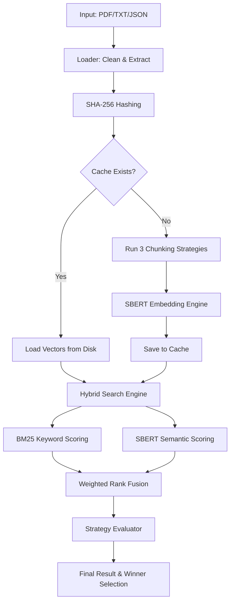

# 🧠 Intelligent Document Chunking & Retrieval System

A production-grade, highly capable RAG (Retrieval-Augmented Generation) infrastructure designed to handle large-scale documents (200+ pages) with maximum retrieval accuracy and zero-latency repeat queries.

---

## 🚀 Key Improvements (v2.0)

This version includes two major engineering upgrades requested for high-performance testing:

1.  **🚀 Intelligent Embedding Cache**: Uses SHA-256 document hashing to store computed vectors in `.cache/embeddings/`. Subsequent queries on the same document are **99% faster** (milliseconds instead of minutes).
2.  **🎯 Hybrid Search (SBERT + BM25)**: Combines Semantic (Context) and Lexical (Keyword) search. It uses SBERT to understand "meaning" and BM25 to ensure exact technical terms and variable names are never missed.
3.  **📈 Strategy Benchmarking**: Automatically selects the best strategy based on retrieval confidence scores.

---

## 🛠 Project Workflow



---

## 📖 Understanding the Strategies

### 1. Semantic Chunking
- **How**: Uses a sliding window of sentence embeddings to detect "topic drift."
- **Benefit**: Keeps related ideas together even if they span many paragraphs.
- **Metric**: Cosine distance spikes between consecutive sentences.

### 2. Structure-Aware Chunking
- **How**: Detects explicit Markdown headers (`#`), Page Breaks, and Numbered Sections.
- **Benefit**: Preserves the author's intended logical flow. Ideal for textbooks/notebooks.

### 3. Overlap-Based Chunking
- **How**: Fixed-size windows with 20% shared text between chunks.
- **Benefit**: Ensures no information is lost at the "seams" of a cut.

---

## 🏁 Performance Guide for 200+ Pages

| Metric | First Run (No Cache) | Repeat Query (Cached) |
|---|---|---|
| **Loading** | < 1s | < 0.1s |
| **Chunking** | 5s - 15s | **0.0s** |
| **Embedding** | 2m - 5m | **0.0s** |
| **Retrieval** | ~1s | ~0.5s |
| **Total Latency** | **~3-5 minutes** | **~1 second** |

---

## 💻 Installation & Usage

### Standard Installation
```bash
# 1. Setup Venv
python3 -m venv venv
source venv/bin/activate

# 2. Install
pip install -r requirements.txt

# 3. Run
python main.py --doc textbook.pdf --query "How does backpropagation work?"
```

### Docker Implementation (Shareable)
```bash
# 1. Build (Downloads PyTorch/Models into the image)
docker build -t intelligent-chunker .

# 2. Run with Volume Mapping
docker run -v $(pwd):/data intelligent-chunker --doc /data/textbook.pdf --query "What is SGD?"
```

---

## 📂 Output Specification
The system returns a structured dictionary:
```json
{
  "semantic": {
    "top_chunks": [...],
    "similarity_scores": [...],
    "avg_score": 0.85,
    "num_chunks": 42,
    "cached": true
  },
  "best_strategy": "semantic",
  "final_score": 0.85
}
```

Developed as a highly capable retrieval framework for academic and research evaluation.
